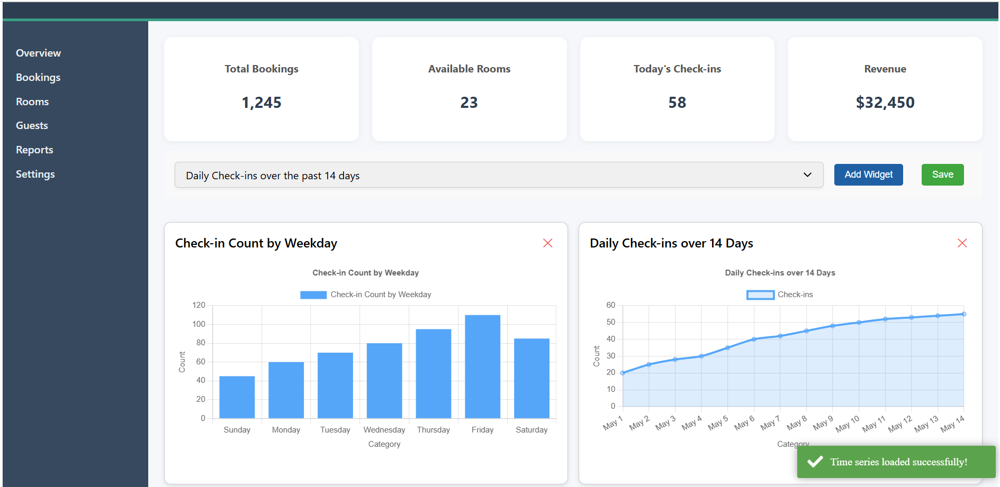

# ClientApp

This project was created using 

✅ Angular CLI version: 19.2.12 [Angular CLI](https://github.com/angular/angular-cli)

✅ Node.js version: v20.11.1

✅ npm version: 10.2.4

## Development server

To start a local development server, run:

```bash
ng serve
```

Once the server is running, open your browser and navigate to `http://localhost:4200/`. The application will be launched.


## Additional Resources

For more information on using the Angular CLI, including detailed command references, visit the [Angular CLI Overview and Command Reference](https://angular.dev/tools/cli) page.

# 🧩 Introduction to PMS Admin Dashboard (Modular & Standalone)

This is a modular admin dashboard built using **Angular 19** with **standalone components**, **PrimeNG**, **Chart.js**, and a layered architecture.

---

## 🔍 Overview

- 📊 Dynamic Bar & Time Series Chart Widgets (ng2-charts / PrimeNG)
- 👤 Admin-only widget controls with localStorage flags
- 🔐 Auth Interceptor for secure HTTP requests
- 🌐 Global Toastr notification wrapper
- 📦 NGX-Logger-based logging service
- 🧪 Jasmine/Karma-based unit testing setup
- 🌀 Core loading interceptors
- 📁 Standalone components architecture (Angular 17+)

---

## 📦 Tech Stack

- **Angular 19** (standalone components)
- **PrimeNG** for UI widgets
- **ng2-charts / Chart.js** for visualizations
- **ngx-toastr** for notifications
- **ngx-logger** for logging
- **RxJS** for reactive programming

---

## Building

To build the project run:

```bash
ng build
```

This will compile your project and store the build artifacts in the `dist/` directory. By default, the production build optimizes your application for performance and speed.

---

## Running unit tests

To execute unit tests with the [Karma](https://karma-runner.github.io) test runner, use the following command:

```bash
ng test

ng test --code-coverage
```


---

## 📁 Folder Structure

```
src/
└── app/
    ├── main/
    │   └── admin/
    │       ├── components/
    │       │   └── admin-dashboard/
    │       │       ├── admin-dashboard.component.html
    │       │       ├── admin-dashboard.component.scss
    │       │       ├── admin-dashboard.component.spec.ts
    │       │       └── admin-dashboard.component.ts
    │       ├── models/
    │       └── services/
    │
    ├── core/
    │   ├── interceptors/
    │   │   ├── auth.interceptor.spec.ts
    │   │   └── auth.interceptor.ts
    │   ├── models/
    │   └── services/
    │       ├── logger.service.spec.ts
    │       └── logger.service.ts
    │
    ├── layout/
    │   └── layout/
    │       ├── layout.component.html
    │       ├── layout.component.scss
    │       ├── layout.component.spec.ts
    │       └── layout.component.ts
    │
    ├── shared/
    │   ├── components/
    │   │   ├── chart-widget/
    │   │   └── generic-chart-widget/
    │   ├── models/
    │   ├── pipes/
    │   └── services/
    │       ├── toastr-message-wrapper.service.spec.ts
    │       └── toastr-message-wrapper.service.ts
    │
    ├── app.component.html
    ├── app.component.spec.ts
    ├── app.component.ts
    └── app.config.ts

```

## UI/UX





```
