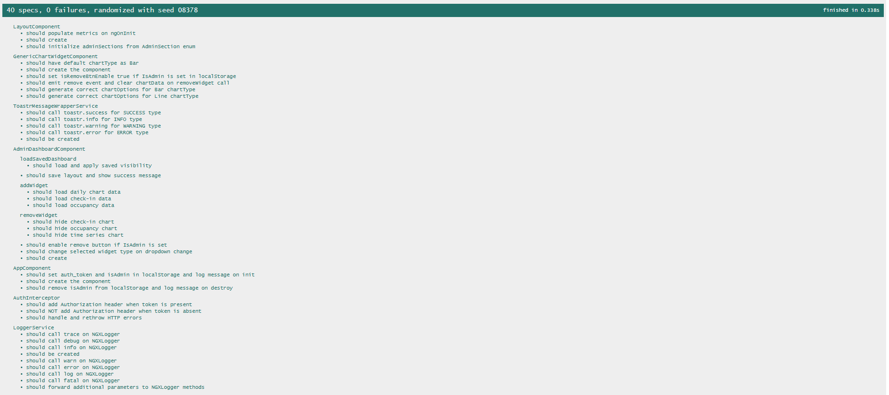
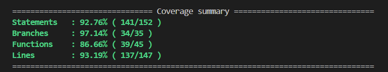
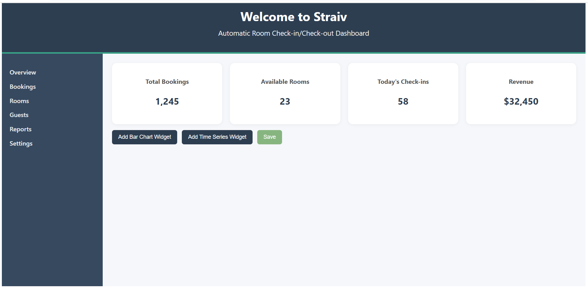
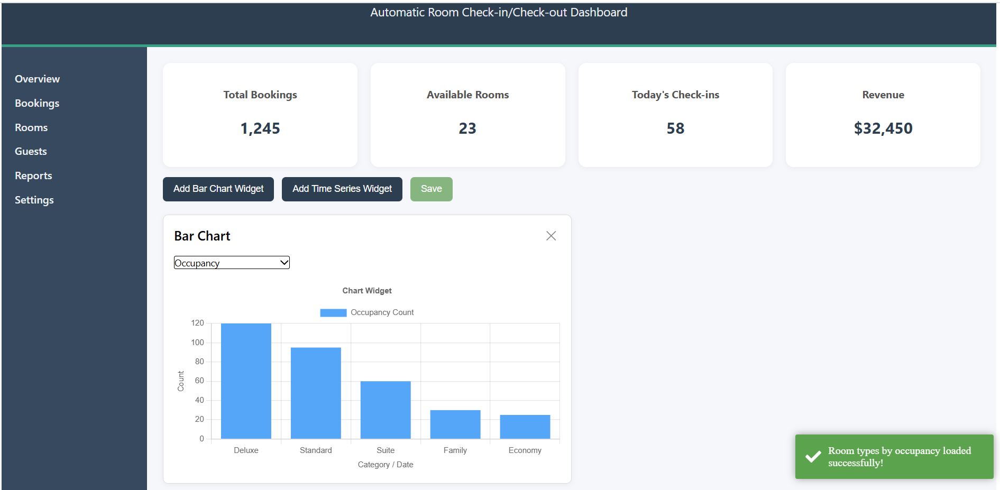
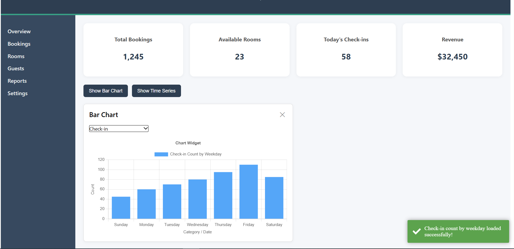
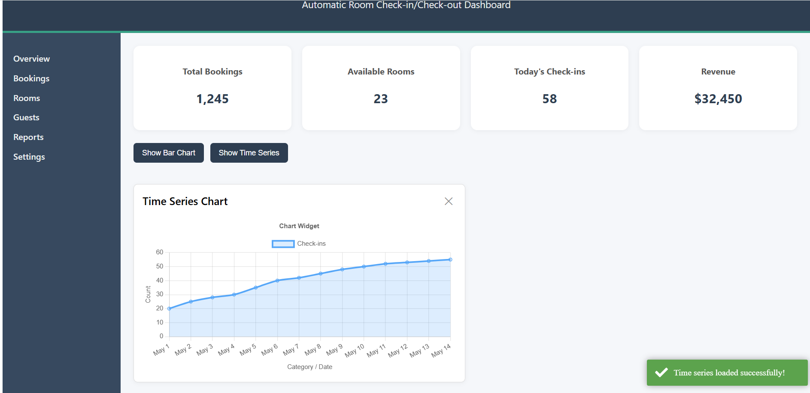
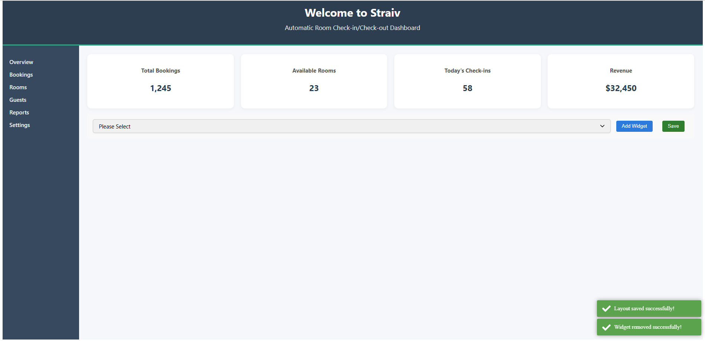
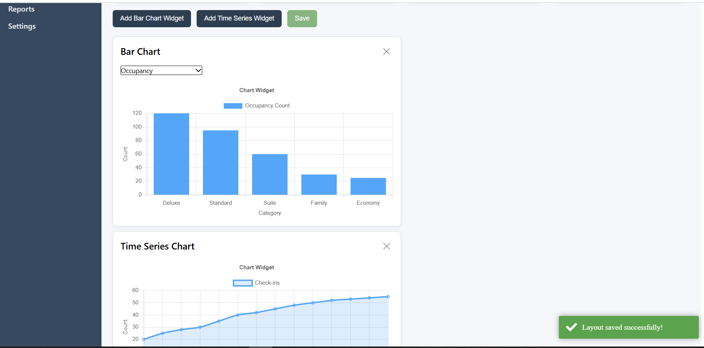

# ClientApp

This project was generated using [Angular CLI](https://github.com/angular/angular-cli) version 19.2.12.

## Development server

To start a local development server, run:

```bash
ng serve
```

Once the server is running, open your browser and navigate to `http://localhost:4200/`. The application will automatically reload whenever you modify any of the source files.


## Additional Resources

For more information on using the Angular CLI, including detailed command references, visit the [Angular CLI Overview and Command Reference](https://angular.dev/tools/cli) page.

# 🧩 Introduction to PMS Admin Dashboard (Modular & Standalone)

This is a modular admin dashboard built using **Angular 19** with **standalone components**, **PrimeNG**, **Chart.js**, and a layered architecture.

---

## 🔍 Overview

- 📊 Dynamic Bar & Time Series Chart Widgets (ng2-charts / PrimeNG)
- 👤 Admin-only widget controls with localStorage flags
- 🔐 Auth Interceptor for secure HTTP requests
- 🌐 Global Toastr notification wrapper
- 📦 NGX-Logger-based logging service
- 🧪 Jasmine/Karma-based unit testing setup
- 🌀 Core loading spinner service and interceptors
- 📁 Standalone components architecture (Angular 17+)

---

## 📁 Folder Structure

```
src/
└── app/
    ├── main/
    │   ├── admin/
    │   │   ├── components/
    │   │   │   ├── admin-dashboard/             # Admin dashboard component
    │   │   │   ├── bar-chart-widget/            # Bar chart widget component
    │   │   │   └── time-series-chart-widget/    # Time series chart widget component
    │   │   ├── models/                          
    │   │   │   ├── dashboard.ts                 # Interfaces and types related to dashboard
    │   │   │   └── enums.ts                     # Enum definitions for admin section
    │   │   └── services/
    │   │       ├── chartdata.service.ts         # Service for fetching chart data
    │   │       └── dashboard.service.ts         # Business logic for dashboard
    │   └── core/
    │       ├── interceptors/
    │       │   ├── auth.interceptor.ts          # Auth token interceptor
    │       │   └── auth.interceptor.spec.ts     # Unit tests for auth interceptor
    │       └── services/
    │           ├── logger.service.ts            # Logging service
    │           └── logger.service.spec.ts       # Unit tests for logger service
    ├── layout/                                  # Layout components like header/side panel/footer
    └── shared/
        ├── components/
        │   └── chart-widget/                    # Shared chart widget component
        │       ├── chart-widget.component.html
        │       └── chart-widget.component.ts
        ├── models/
        │   └── enums.ts                         # Shared enums used across app
        ├── pipes/                               # (Expected) shared pipes
        └── services/
            ├── toastr-message-wrapper.service.ts     # Toastr notification service
            └── toastr-message-wrapper.service.spec.ts
├── app.component.ts
├── app.component.html
├── app.component.spec.ts
├── app.config.ts                                # Application-wide config
└── index.html                                   # App entry point

```

---

## 📦 Tech Stack

- **Angular 19** (standalone components)
- **PrimeNG** for UI widgets
- **ng2-charts / Chart.js** for visualizations
- **ngx-toastr** for notifications
- **ngx-logger** for logging
- **RxJS** for reactive programming

---

## Building

To build the project run:

```bash
ng build
```

This will compile your project and store the build artifacts in the `dist/` directory. By default, the production build optimizes your application for performance and speed.

---

## Running unit tests

To execute unit tests with the [Karma](https://karma-runner.github.io) test runner, use the following command:

```bash
ng test
```




---

## UI/UX









```
